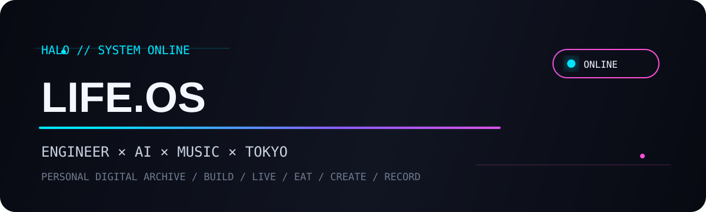

<div align="center">



<br/>

### `ENGINEER × AI × MUSIC × TOKYO`

コード、音楽、ライブ、グルメ、日々の記録をまとめる個人アーカイブ。

<br/>


</div>

---

## // NOW

| | Current |
|---|---|
| 🎧 Listening | Vocaloid / Project Sekai |
| 🎤 Live | Magical Mirai / Vocaloid events |
| 💻 Building | AI × Engineering × Automation |
| 🍜 Exploring | Tokyo food & drinks |
| 🎨 Creating | Illustration / Generative AI |
| 📓 Recording | Daily logs & personal archive |

---

## // EXPLORE

<table>
<tr>
<td width="50%">

### 💻 ENGINEERING
AI / Python / Cloud / Automation

[→ Explore Engineering](./engineering/)

</td>
<td width="50%">

### 🎤 LIVE
Setlists / Venues / Memories

[→ Explore Live Archive](./live-archive/)

</td>
</tr>

<tr>
<td>

### 🎧 MUSIC
Vocaloid / Favorite tracks / Playlists

[→ Explore Music Archive](./music-archive/)

</td>
<td>

### 🍜 FOOD
Tokyo restaurants / Cafes / Bars

[→ Explore Food Archive](./food-archive/)

</td>
</tr>

<tr>
<td>

### 🎨 CREATIVE
Illustration / Image generation / Design

[→ Explore Creative Archive](./creative-archive/)

</td>
<td>

### 📓 DAILY
Notes / Events / Small discoveries

[→ Explore Daily Log](./daily-log/)

</td>
</tr>
</table>

---

## // RECENT SIGNALS

```text
2026.09  GitHub LIFE.OS redesign
2026.09  Live setlist archive expansion
2026.09  Tokyo food database started
2026.09  AI × engineering workflow experiments
```

---

## // LIFE DATABASE

```text
LIVE COUNT      24
FOOD LOG        37
PROJECTS        12
CREATIVE LOG    18
STATUS          ● ONLINE
```

> 数字はサンプルです。実データに置き換えてください。

---

## // TECH

`Python` `GCP` `AWS` `SQL` `GitHub` `Generative AI` `Automation`

---

## // DESIGN SYSTEM

- Background: `#080A12`
- Surface: `#111522`
- Cyan: `#00E5FF`
- Purple: `#8B5CF6`
- Pink: `#FF4FD8`
- Text: `#F4F7FF`

---

<div align="center">

`HALO / LIFE.OS — personal digital archive`

</div>
