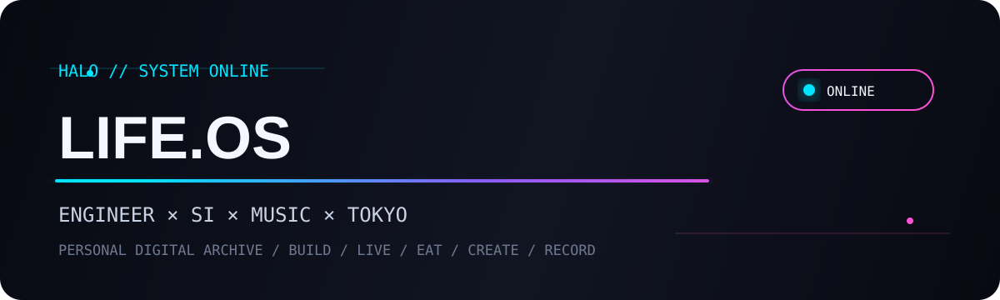

<div align="center">



<br/>

### `ENGINEER × AI × MUSIC × TOKYO`

コード、音楽、ライブ、グルメ、日々の記録をまとめる個人アーカイブ。

<br/>


</div>

---

## // EXPLORE

<table>
<tr>
<td width="50%" valign="top">

### 💻 ENGINEERING
AI / Python / Cloud / Automation

[→ Explore Engineering](./engineering/)

</td>
<td width="50%" valign="top">

### 🎤 LIVE
Setlists / Venues / Memories
参加履歴: encore-log.md

[→ Explore Live Archive](./live-archive/)<br/>
[→ History / 参加履歴](./live-archive/encore-log.md)<br/>
[→ Favorites / Interesting](./live-archive/Interesting.md)

</td>
</tr>

<tr>
<td>

### 🎧 MUSIC
Vocaloid / Favorite tracks / Playlists

[→ Explore Music Archive](./music-archive/)

</td>
<td>

### 🎨 CREATIVE
Illustration / Image generation / Design

[→ Explore Creative Archive](./creative-archive/)

</td>
</tr>

<tr>
<td>

### 📓 DAILY
Notes / Events / Small discoveries

[→ Explore Daily Log](./daily-log/)

</td>
<td width="50%" valign="top">

### 🍜 FOOD
Tokyo restaurants / Cafes / Bars

[→ Explore Food Archive](./food-archive/)

</td>
</tr>
</table>

---

## // RECENT SIGNALS

```text
2026.09  GitHub LIFE.OS redesign
2026.09  Live setlist archive expansion
2026.09  Tokyo food database started
2026.09  AI × engineering workflow experiments
```

---

## // ENGINEER

> Software Engineer / AI × Engineering / Tokyo

- **Focus:** Generative AI の業務活用 / Python による自動化 / GCP・AWS / SQL・データ処理
- **Main Stack:** `Python` `SQL` `GCP` `AWS` `GitHub` `Generative AI`
- **Project:** [LIFE.OS](./engineering/projects/life-os.md) — このリポジトリ自体を、AI 半自動生成つきの個人データ基盤として設計

[→ Engineer Profile](./engineering/profile.md)

---

## // TYPING

- Keyboard: REALFORCE R3S（有線 / フル / 45g / 英語配列 / ブラック / R3SB11）
- Record: [monkeytype](https://monkeytype.com/profile/haloyukka)

---

## // LINKS

| Service | Link |
|---|---|
| GitHub | [@haloyukka](https://github.com/haloyukka) |
| monkeytype | [haloyukka](https://monkeytype.com/profile/haloyukka) |

---

<div align="center">

`HALO / LIFE.OS — personal digital archive`

</div>
