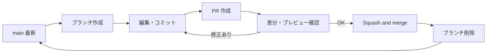

# Git 運用手順書

[← HOME](../README.md) / [Content Rules](../CONTRIBUTING.md)

このリポジトリ（`haloyukka/haloyukka`）の変更を、**ブランチ → Pull Request → マージ**の流れで行うための手順書。

---

## 1. 背景と課題

2026-09-28 時点の `main` の直近40コミットを確認した結果:

| 項目 | 状況 |
|---|---|
| PR 経由のマージ | 3件 |
| `main` への直接コミット | 36件（GitHub の Web 画面での編集が中心。`Update README.md` などの既定メッセージが多い） |
| コミットの作者名 | `halohalo` と `haloyukka` の2種類が混在。一部は個人のメールアドレスで記録されている |

これにより、次の問題が起きている。

- **変更の単位と理由が残らない:** 「何のために、どこからどこまで変えたか」を後から追えない
- **確認の機会がない:** プレビューや差分を見ずに本番（プロフィール画面）へ直接反映される
- **戻しにくい:** 小さな直接コミットが連続し、1つの変更を丸ごと取り消しにくい
- **作業中のブランチと衝突する:** 作業中のブランチの裏で `main` が変わり、差分が膨らむ

## 2. 基本ルール

1. **`main` へ直接コミットしない。** すべての変更はブランチを作って PR で取り込む
2. **1つの目的 = 1ブランチ = 1PR。** 関係のない変更を混ぜない
3. **マージ前に差分とプレビューを自分で確認する**（[§7 セルフチェック](#7-pr-セルフチェックリスト)）
4. **マージは Squash and merge。** PR 1件が `main` の1コミットになる
5. **マージ済みのブランチは削除し、再利用しない。** 次の変更は最新の `main` から新しいブランチを作る



## 3. 命名規則

### ブランチ名

`<type>/<短い説明>`（lowercase + kebab-case、ASCII のみ）

| type | 用途 | 例 |
|---|---|---|
| `content/` | アーカイブの記録追加・更新（ライブ・グルメ・日記など） | `content/magical-mirai-2026-osaka-day` |
| `feat/` | 新しいセクション・仕組みの追加 | `feat/engineer-profile` |
| `fix/` | 誤り・リンク切れの修正 | `fix/encore-log-link` |
| `docs/` | 規約・手順書の更新 | `docs/git-workflow` |
| `chore/` | 設定・整理など内容に関係しない変更 | `chore/remove-timestamp-workflow` |

Claude Code が作るブランチ（`claude/...`）はそのまま使ってよい。ただしマージ後は再利用しない。

### コミットメッセージ・PR タイトル

[Conventional Commits](https://www.conventionalcommits.org/ja/v1.0.0/) 形式。Squash and merge では **PR タイトルが `main` のコミットメッセージになる**ので、PR タイトルもこの形式にする。

```text
<type>(<範囲>): <何をしたか>

例:
content(live-archive): add Magical Mirai 2026 Osaka day setlist
fix(readme): correct encore-log link
docs: add git workflow guide
```

`範囲` は `readme` / `live-archive` / `engineering` / `food-archive` などのディレクトリ名。日本語の説明でもよい。

---

## 4. 手順A: GitHub の Web 画面で編集する（普段の更新）

ブラウザだけで完結する手順。README の軽い修正やライブ記録の追加はこれで行う。

1. 編集したいファイルを開き、右上の ✏️（Edit this file）を押す
2. 内容を編集し、**Preview** タブで表示を確認する
3. **Commit changes...** を押す
4. ダイアログで次のように入力する
   - **Commit message:** `content(live-archive): add ...` の形式
   - **「Create a new branch for this commit and start a pull request」を選ぶ**（「Commit directly to the main branch」は選ばない）
   - ブランチ名を `<type>/<短い説明>` に変更する
5. **Propose changes** → PR 作成画面で **Create pull request**
6. 同じ PR に追加で変更する場合は、PR の **Files changed** から該当ファイルを開くか、ブランチを切り替えて編集し、同じブランチへコミットする
7. [§7 セルフチェック](#7-pr-セルフチェックリスト)を行う
8. **Squash and merge** → **Confirm squash and merge**
9. **Delete branch** を押す（[§6](#6-リポジトリ設定) の自動削除を有効にしていれば不要）

> 複数ファイルをまとめて変更する場合は、リポジトリ画面で `.` キーを押すと開く github.dev（ブラウザ版 VS Code）が便利。左の Source Control から新しいブランチを作ってコミットし、PR を作成する。

## 5. 手順B: ローカル（CLI）で編集する

```bash
# 1. 最新の main を取得してブランチを作る
git switch main
git pull origin main
git switch -c content/magical-mirai-2026-osaka-day

# 2. 編集してコミット（小さく分けてよい。マージ時に1つにまとまる）
git add live-archive/
git commit -m "content(live-archive): add Magical Mirai 2026 Osaka day setlist"

# 3. push して PR を作る
git push -u origin content/magical-mirai-2026-osaka-day
#   → 表示される URL、または GitHub の「Compare & pull request」ボタンから PR を作成

# 4. マージ後の後片付け
git switch main
git pull origin main
git branch -d content/magical-mirai-2026-osaka-day
```

作業中に `main` が進んだ場合は、ブランチに取り込んでから push する。

```bash
git fetch origin
git merge origin/main   # 競合したら §8 を参照
git push
```

### 手順C: Claude Code に依頼する場合

- 依頼時に「ブランチを作って PR を作成して」と明示する（§6.1 の保護設定があれば `main` への直接 push は拒否される）
- 作成された PR の差分を §7 で確認してからマージする
- **マージ済みの PR のブランチに追加の変更を積まない。** 続きの作業は新しい PR として依頼する

---

## 6. リポジトリ設定

一度だけ設定する。これにより、**Web 画面でもうっかり `main` へ直接コミットできなくなる**（仕組みで防ぐ）。

### 6.1 `main` の保護（Ruleset）

**Settings → Rules → Rulesets → New ruleset → New branch ruleset**

| 項目 | 設定値 |
|---|---|
| Ruleset Name | `protect-main` |
| Enforcement status | **Active** |
| Bypass list | 空のまま（緊急時は一時的に Enforcement を Disabled にする） |
| Target branches | **Add target → Include default branch** |
| Restrict deletions | ✅ |
| Require a pull request before merging | ✅（**Required approvals: 0**。1人運用では自分の PR を承認できないため） |
| Block force pushes | ✅ |

**Create** で保存する。

> Ruleset は公開リポジトリなら無料プランでも有効。このリポジトリはプロフィール用で公開されているため利用できる。

### 6.2 マージ方式とブランチの自動削除

**Settings → General → Pull Requests**

| 項目 | 設定値 |
|---|---|
| Allow merge commits | ☐（オフ） |
| Allow squash merging | ✅（Default commit message: **Pull request title**） |
| Allow rebase merging | ☐（オフ） |
| Automatically delete head branches | ✅ |

### 6.3 コミットの作者情報の統一

コミットの作者名が `halohalo` / `haloyukka` に分かれ、一部は個人のメールアドレスで記録されている。公開リポジトリではメールアドレスも公開されるため、GitHub の noreply アドレスに統一する。

1. **GitHub → Settings → Emails** で **Keep my email addresses private** と **Block command line pushes that expose my email** を ✅
2. ページに表示される `<ID>+<ユーザー名>@users.noreply.github.com` を確認する
3. ローカルの Git に設定する

```bash
git config --global user.name  "haloyukka"
git config --global user.email "<ID>+haloyukka@users.noreply.github.com"
```

> 過去のコミットに残ったアドレスは履歴の書き換えが必要なため、ここでは対象外とする。

---

## 7. PR セルフチェックリスト

マージ前に PR の **Files changed** と **Preview** を見て確認する。

- [ ] PR の目的が1つに絞られている（関係ない変更が混ざっていない）
- [ ] PR タイトルが `<type>(<範囲>): <何をしたか>` 形式になっている
- [ ] 意図しないファイル（一時ファイル・不要な削除）が含まれていない
- [ ] 表示を確認した（README・表・画像・リンク）
- [ ] 相対リンクが切れていない
- [ ] 公開して問題ない情報だけになっている（[CONTRIBUTING.md](../CONTRIBUTING.md)）
- [ ] 各ディレクトリの規約に従っている（例: [live-archive/CLAUDE.md](../live-archive/CLAUDE.md)）
- [ ] `main` との競合がない（PR 画面に「This branch has no conflicts」と出ている）

---

## 8. トラブル対応

### 間違えて `main` にコミットした（まだ push していない）

```bash
git switch -c fix/<説明>          # 今のコミットを新しいブランチに残す
git switch main
git reset --hard origin/main      # main を GitHub と同じ状態に戻す
git switch fix/<説明>
git push -u origin fix/<説明>     # → PR を作成
```

### 間違えて `main` に反映してしまった（push 済み・Web で直接コミット）

履歴は書き換えず、**打ち消しのコミットを PR で入れる**。

- **PR 経由でマージしたもの:** マージ済み PR の画面下部の **Revert** ボタン → 作成された PR をマージ
- **直接コミットしたもの:**

```bash
git switch main && git pull origin main
git switch -c fix/revert-<説明>
git revert <コミットID>
git push -u origin fix/revert-<説明>   # → PR を作成
```

### PR で競合（conflict）が出た

- **Web:** PR 画面の **Resolve conflicts** を押し、`<<<<<<<` 〜 `>>>>>>>` の間を正しい内容に直して **Mark as resolved** → **Commit merge**
- **ローカル:**

```bash
git fetch origin
git merge origin/main
# 競合ファイルを編集して印を消す
git add <ファイル>
git commit
git push
```

### マージ済みのブランチで続きの作業をしてしまった

新しいブランチに移してから PR にする。

```bash
git fetch origin
git switch -c <type>/<新しい説明> origin/main
git cherry-pick <追加したコミットID>...
git push -u origin <type>/<新しい説明>
```

---

## 9. 運用開始時の移行手順

1. §6.1〜6.3 のリポジトリ設定を行う
2. ローカルに作業中の変更があれば、§5 の手順でブランチに移して PR にする
3. 以後の変更は §4（Web）または §5（CLI）で行う
